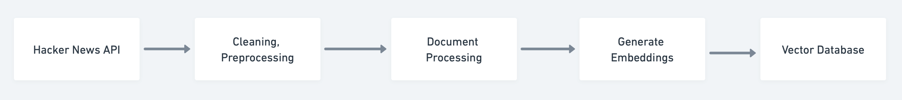

# A real-time data ingestion pipeline

I am creating a data ingestion pipeline with bytewax, qdrant and huggingface for RAG-based applications. 

The goal is to create a pipeline to save the real-time context in a vector database, enhancing query responses. 

Using [bytewax](https://bytewax.io) we can create a dataflow that defines an input, performs transformations and defines an output.

TL;DR
1. fetch data from Hacker News using its [API](https://github.com/HackerNews/API) every 15s
2. retrieve URLs from the [metadata](https://hacker-news.firebaseio.com/v0/item/8863.json?print=pretty)
3. get HTML content from these URLs
4. use [unstructured](https://unstructured.io) to process the data
5. generate embeddings using a model from HuggingFace
6. writes results to the qdrant

Bytewax's API simplifies this complex data processing approach.

